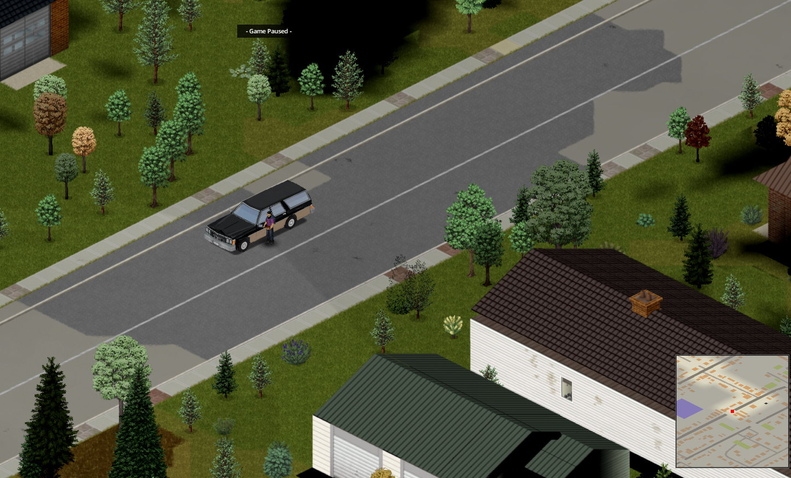
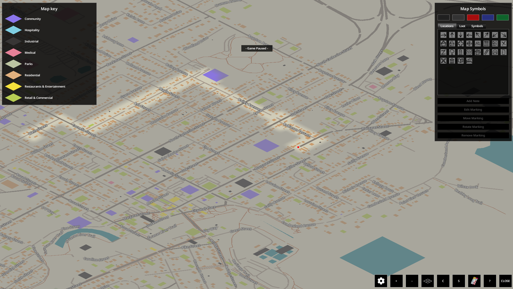

# pz-world

**Play Project Zomboid anywhere on Earth.** Start a new game, type in
coordinates, and the world builds itself from the real place at those numbers —
roads on their real bearings, real building footprints, shops where the shops
are and hospitals where the hospitals are.



*Plattsburgh, New York — 44.6995, -73.4529. Every road, kerb, pavement, verge and
house position comes from OpenStreetMap; the buildings themselves are real
Project Zomboid interiors, read out of your own copy of the game.*

Open the map and it is the actual town. Real street names, out of OpenStreetMap
and into the game's own map screen, with buildings coloured by what they are:



*Bailey Avenue, Cornelia Street, Margaret Street, the Saranac River Trail, and
Lake Champlain off to the east — because that is what is there.*

One mod. Not tied to any city. Its own world, not a district bolted onto Knox
County. Type different numbers and you get a different town.

```
New Game → pz-world panel
  Latitude   44.6995        Longitude  -73.4529
  Radius     2500 m         Seed       (auto)

  [ Plattsburgh, NY ] [ Burlington, VT ] [ Manhattan, NY ]
  [ New Orleans, LA ] [ Paris ] [ Tokyo ]

  ████████████████░░░░░░░░  63%
  Laying roads  (241 of 370)
```

---

## Setup

**Requirements:** Node 22+, Project Zomboid Build 42 installed. No npm
dependencies.

```bash
npm run setup
```

That runs three steps, and you only need it once:

| step | what it does |
|---|---|
| `extract` | indexes ~9,100 buildings in **your own** Project Zomboid install |
| `canvas` | builds the blank 20.5 km world the mod ships |
| `build` | assembles the mod, block-checks every Lua file, installs it |

Then, whenever you want to play:

```bash
npm run helper
```

Leave that running. It is the part that does what Lua cannot: Project Zomboid's
Lua sandbox cannot open a socket **and cannot write a byte above 0x7F**, and a
map cell is binary. So when you press **Build this world** the helper fetches
OpenStreetMap and writes the cells, while the game holds a progress screen in
front of you until they are on disk.

Launch Project Zomboid, enable **pz-world**, and start a **new** game. Pick
**PZWorld** on the world-select screen and press Next — the panel opens there, and
only there, so nothing appears in front of you at launch or when you load an old
save. Type coordinates, pick a radius, watch it build. **F7** opens the panel
anywhere, at any time.

You can also build a city straight from the command line, which is the same
build the panel orders:

```bash
npm run world -- --lat 44.6995 --lon -73.4529 --radius 2500 --name "Plattsburgh, NY"
```

Three things that matter and are easy to get wrong:

- **`npm run build` keeps a built world**, and copies in only map companions the
  install does not already have. `npm run build -- --fresh` puts the blank canvas
  back, which is what you want when the canvas format itself has changed.
- **Quit the game before running `npm run world`.** The game keeps file handles open
  on map cells it has read, and on Windows rewriting an open file fails outright.
  The in-game panel does not have this problem: it builds at the main menu,
  before any cell has been opened.
- **Start a new save.** A chunk you have already walked through is served from the
  save, not from the map, so an old save keeps the old world.

---

## Validate and benchmark

Run the complete offline acceptance set after changing assets, surfaces, roads, or cell
emission:

```bash
npm test
npm run verify-inventory-assets
npm run verify-semantic-registry
npm run audit-real-world-fixtures
npm run audit-tile-usage        # what artwork is actually on the ground
npm run benchmark-asset-pipeline
npm run verify -- mod
npm run validate-asset-pipeline  # release gate; requires accepted Build 42 runtime evidence
```

`audit-tile-usage` counts placements per asset family and per tile across the emitted
cells. It is the check that answers *which sprites are on the ground*, which is the
question every other one of these can pass while getting wrong: the whole road-artwork
pass was disconnected from the shipped world for months behind a green test suite
(`docs/LIMITATIONS.md` §0). Run it before and after a change and diff the two.

The benchmark writes `library/asset-pipeline-benchmark.json` and
`docs/ASSET-PIPELINE-VALIDATION.md`. It records build time, heap delta, cell-file sizes,
asset repetition, ownership collisions, and continuity at cell seams. `verify -- mod`
re-reads all authored cells in Build 42's split `42/` + `common/` layout.

Offline checks cannot prove that native collision, artwork, or chunk streaming behaves
correctly. The installed `PZWorld_ValidationProbe.lua` observes a five-minute game run
without altering map squares. In a **new Build 42 save**, cross at least 20 eight-square
chunk boundaries and two 256-square cell boundaries, visually inspect the urban/rural/highway/bridge route described in the
validation report, quit, and validate the captured console:

```bash
npm run validate-in-game-probe -- "<Zomboid user folder>/console.txt" \
  --observations docs/runtime-observations.json
```

A passing command writes `library/in-game-probe-validation.json`. The run is not accepted
without both that machine-readable record and the visual/collision checklist; absence of
a transcript is reported as pending, never treated as a pass.

---

## How it works

The world is **authored**: the build writes real Project Zomboid map cells over
the blank canvas the mod ships, and the game loads them the way it loads
Muldraugh.

The panel and the command line are two front doors onto the same build. The
panel writes an order to a file in `Zomboid/Lua/`, the helper picks it up and
runs it, and the build screen blocks the game until the last cell is written —
which is the moment that matters, because `MapFiles.load()` re-lists the map
directory at world init but `IsoLot.pool` holds cell files open once the world
starts streaming.

```
you type coordinates  ─────▶  build order file  ─────▶  helper
        ▲                                                  │
        │  progress file, read every frame                 │
        └──────────────────────────────────────────────────┤
                                                           ▼
   fetch Overpass, classify, project, clip
        │
        ▼
   find the city's dominant street bearing, rotate the world onto the grid
        │
        ▼
   place buildings by class and size, out of your own install
        │
        ▼
   lay roads at their true bearings; kerbs, pavements, car parks
        │
        ▼
   paint ground, then the blend and corner tiles between surfaces
        │
   ┌────┴──────────────────────────────────────────────┐
   │ write into the installed mod                      │
   │   <cx>_<cy>.lotheader     tiles, rooms, buildings │
   │   world_<cx>_<cy>.lotpack 8 levels of tile data   │
   │   chunkdata_<cx>_<cy>.bin collision summary       │
   │   maps/biomemap_*.png     so the game keeps it    │
   │   worldmap.xml.bin        the map you see on M    │
   │   streets.xml             street names on it      │
   │   objects.lua             parking zones → cars    │
   │   spawnpoints.lua         where you start         │
   └───────────────────────────────────────────────────┘
        │
        ▼
   launch the game; it streams the cells as you explore
```

Build 42 also ships a **runtime world generator** — `WorldGenerateThread`,
`ChunksCache`, `PrefabStructure`, `StaticModule` — driven from two plain Lua
tables, and this mod used to build the city that way. It cannot express an
upstairs, a roof, or a room definition: `PrefabStructure` hard-codes four tile
layers and has no z axis. So that route is retired for the city and kept for the
countryside outside the requested radius, where none of its limits bite and free
procedural terrain beats authored flat grass. See
[docs/WORLDGEN.md](docs/WORLDGEN.md).

Running both at once is the one thing that must not happen: they are two
different worlds over the same ground, and the mod no longer populates
`worldgen.static_modules` at all.

### Roads keep their bearing; buildings cannot

A Project Zomboid wall is drawn on the north or west edge of a square, so a
building gets one of four orientations and nothing between.

Roads are different. Nothing about a road has to sit on an edge, so a street
keeps its true bearing and is drawn as a stairstep — carriageway, kerb and
pavement filled outward from the real centreline — while buildings are snapped.
The cost of that snap is made small by rotating the whole city once first, onto
its own commonest street direction. The build reports what it cost.

The game also ships two *diagonal* kerb sheets declared as `FloorOverlay`,
painted on top of square ground, which vanilla uses on 1:1 runs so the visible
road edge can run at an angle while the walkable grid stays square. pz-world does
not use them yet: measurement shows they are laid as runs of six consecutive
tiles along a diagonal, not as a single edge tile, and substituting one tile for
the sheet draws the wrong facing three times out of four. The four axis-aligned
kerbs it does use were measured against 30,000 Muldraugh squares, as was the
pavement's width — one square, which is what 82.6% of Muldraugh's are
([DEV_GUIDE §2.14](DEV_GUIDE.md)).

### The buildings are whole buildings

Nothing here invents a building. The shipped map is a labelled corpus: **9,089**
hand-authored buildings, each a list of **named rooms** (`kitchen`,
`grocerystorage`, `prisoncells`) because the game's own loot system keys off
those names. That classification is what lets an OSM `shop=supermarket` become
an actual shop rather than a shop-shaped box.

What arrives in the world is that building, **all of it** — every storey, the
roof and the ceilings, all twelve tiles a square can carry, the doors, the
windows, the light switches, and the room definitions the loot and alarm systems
read. It is copied square for square out of your own installation and turned to
face the street.

That needs the world to be written as real map cells rather than as instructions
for the game's runtime generator, because `PrefabStructure` declares four tile
layers and no level axis — the runtime route *cannot* express an upstairs or a
roof, whatever it is handed. Cells are binary and Project Zomboid's Lua writes
UTF-8 text only, so `npm run world` writes them before the game starts.

The extracted data is derived from The Indie Stone's files on your own machine.
Only an index of *where* each building is gets stored; the tiles are read from
your install at generate time and never redistributed.

---

## Documentation

| | |
|---|---|
| **[DEV_GUIDE.md](DEV_GUIDE.md)** | **Read this first.** Every pitfall, including the `MapGroups` bug that makes a mod's map invisible, and the tools built to work without a debugger. |
| [docs/PZ-FORMATS.md](docs/PZ-FORMATS.md) | The reverse-engineered B42 map formats, with the evidence for each claim. |
| [docs/WORLDGEN.md](docs/WORLDGEN.md) | B42's runtime world generator as a modding surface. |
| [docs/ORIENTATION.md](docs/ORIENTATION.md) | Bearings, oriented bounding boxes, rotating walls as lattice edges. |
| [docs/ARCHITECTURE.md](docs/ARCHITECTURE.md) | The pipeline and module map. |
| [docs/OSM-SEMANTICS.md](docs/OSM-SEMANTICS.md) | Generated inventory of every retained/discarded OSM element, geometry, and observed tag. |
| [docs/PROTOTYPES.md](docs/PROTOTYPES.md) | Extraction, classification, fitting. |
| [docs/DECISIONS.md](docs/DECISIONS.md) | Numbered decision log. |
| [docs/LIMITATIONS.md](docs/LIMITATIONS.md) | What does not work, measured. |
| [helper/protocol.md](helper/protocol.md) | The file protocol between mod and helper. |

## Tools

Built because there is no JDK, decompiler or Lua interpreter on a modding
machine — and guessing without them cost days.

```bash
node tools/classdump.js <file.class> [method]   # read the game's bytecode
node tools/mapgroups.js pzworld                 # will PZ list my map? (offline)
node tools/luacheck.js <file.lua>               # catch a missing `end`
node tools/audit-tile-usage.mjs                 # what art did the build actually use?
node src/cli.js verify <mod dir>                # cells, tiles, biomes, in-game map
```

`audit-tile-usage` reads the emitted cells back off disk and counts every tile
by family, which is how "the roads have no kerbs" stopped being an argument and
became a number.

## Tests

```bash
npm test
```

72 tests against your own install: all 4,065 vanilla cells parse, both binary
writers round-trip byte for byte, all six shipped `worldmap.xml.bin` files
re-encode byte for byte, the cell coordinate convention is re-measured rather
than asserted, rotation is exact on synthetic cases and measured on real
buildings, the road bands are checked square for square against a brute-force
rasteriser at eleven bearings, and the map-grouping rules are pinned.

## World size

The canvas is **80 × 80 cells = 20.5 km square**, a little larger than the whole
of vanilla Knox County (78 × 63 cells, 19.9 × 16.1 km). A city needs far less
than that; the size is set by mod compatibility rather than by the city.

Many mods hardcode Knox County coordinates — RV Life places its trailer
interiors at x 16,896–18,176 — and a coordinate outside the canvas has no cell
at all, so `IsoLot.getHeader` returns null and the mod fails silently. Sizing the
canvas past Knox County's extent means anything baked in against vanilla still
lands somewhere real. See `mod-src/client/PZWorld_Compat.lua`.

Change `CANVAS_CELLS` in `tools/make-canvas.js` and `Config.lua` together if you
want a different size; an empty cell costs 19.6 kB, so the canvas is ~126 MB.

## Giving it to someone else

**Not the Steam Workshop, and not because nobody has tried.** Three things about
this mod cannot go in a Workshop item:

- **It needs a process outside the game.** Project Zomboid's Lua cannot open a
  socket and cannot write a byte above 0x7F, and a map cell is binary — so the
  fetching and the writing happen in `helper/`, which is Node. A Workshop item is
  Lua and media; it cannot ship or start a program.
- **The buildings are the player's own.** Interiors are read out of *their* copy
  of Project Zomboid by `npm run extract`. That is what makes this shareable at
  all, and it is also why there is nothing to upload: the interesting data does
  not exist until it is built on their machine.
- **The world is bigger than the limit.** A blank canvas is 126 MB and a built
  city is around 470 MB.

So it is shared as a repository, and what a new person needs is:

1. **Node 22 or newer.** This is the real barrier — most Project Zomboid players
   do not have it. https://nodejs.org, the LTS installer, next-next-finish.
2. **Project Zomboid Build 42**, installed and run at least once.
3. Then:

```bash
git clone https://github.com/ElliotTheGreek/pz-world
cd pz-world
npm run setup     # once: indexes their install, builds the canvas, installs the mod
npm run helper    # leave running whenever they play
```

There are no npm dependencies to install and nothing to compile.

### What must not be shared

Two directories are gitignored for a reason, and the reason is not tidiness:

- **`library/`** holds building data read out of a Project Zomboid install. It is
  The Indie Stone's work. It must never be committed or sent to anyone; it is
  rebuilt in a few minutes by `npm run extract` and is specific to a game version
  anyway.
- **A generated map directory** (`Zomboid/mods/pzworld/common/media/maps/PZWorld`
  once a city is in it) contains those same building tiles. Sharing a *world*
  means sharing them. Share the coordinates instead — the same latitude,
  longitude, radius and seed rebuild the same city.

What is safe to share is this repository, and the numbers: a place and a radius.

## Multiplayer

Project Zomboid does not stream map cells. Every client loads them off its own
disk — which is why a map mod has to be installed by everybody — so a shared
world needs **identical cells on every machine**.

There are only two ways to get that, and one of them is bad: ship the built map,
which is half a gigabyte per world and carries Indie Stone building layouts
between people. The other is to have everyone build it themselves, which works
here because the build is reproducible. The same coordinates and seed produce
byte-identical files; there is a test that builds a town twice and compares every
byte, and `test/recipe.test.js` fails if that ever stops being true.

So a world is shared as a **recipe**: one file, a few hundred kilobytes, holding
everything that decides a town.

```bash
# the host builds, and exports what they built
npm run world -- --lat 44.6995 --lon -73.4529 --radius 2500   --name "Plattsburgh, NY" --recipe plattsburgh.json

# everyone else rebuilds the identical town from their own copy of the game
npm run world -- --from-recipe plattsburgh.json
```

Measured on a 600 m town: the rebuild came out **151 of 151 files identical** to
the original.

A recipe pins three things, because coordinates alone are not enough:

| | why it is in there |
|---|---|
| lat, lon, radius, seed | the obvious part, and on its own not sufficient |
| the OpenStreetMap response | OSM changes daily — the same coordinates in March and in June are different towns. The response is embedded, gzipped, so a rebuild never goes to the network and never comes back with different streets. This is also the only part that is legally redistributable: OSM data is ODbL and the attribution travels inside the file. |
| the Project Zomboid version | interiors are read from each player's own install, so a different game build puts different buildings on the same footprints. A mismatch is reported at the start of the rebuild rather than discovered later. |

A recipe contains **nothing of The Indie Stone's** — no tiles, no interiors, no
room layouts. That is what makes it safe to post publicly when a generated map
directory is not.

Every build also drops a `pzworld.json` beside its cells recording the same
facts without the payload, so `npm run verify` can tell you which world is
installed and two players can compare.

### What the mod refuses to do

Building rewrites 484 files. The builder now checks before it opens, and says
why when it will not:

- **Connected to a server** — the world belongs to the host. Ask them for the
  recipe and build it at your own main menu.
- **Hosting** — rebuilding would change the map underneath players who have
  already joined.
- **A game is running** — the cells are open (on Windows, rewriting an open file
  fails outright), and `IsoChunk.LoadOrCreate` prefers the save over the map, so
  the ground you are standing on would not change anyway.

F7 used to open the builder "from anywhere, at any time", which was all three of
those waiting to happen.

### What it costs

Every player needs Node and has to run the helper — there is no version of this
where only the host does. The trade is that nobody sends anybody half a
gigabyte, and everyone's game builds its own buildings out of its own files.

## Licensing

Map data from OpenStreetMap, © OpenStreetMap contributors, under the
[ODbL 1.0](https://www.openstreetmap.org/copyright), with attribution in the
generated `mod.info`.

Building prototypes are generated on your own machine from your own copy of
Project Zomboid and are not redistributed by this project.

pz-world itself is MIT.
